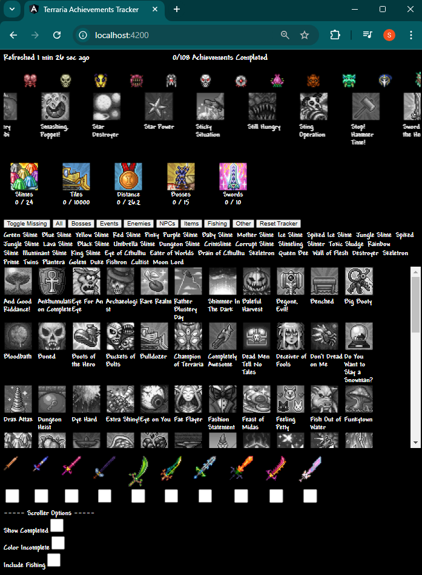
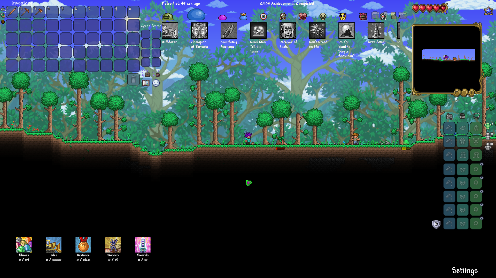

# Terraria Achievements Tracker

## Setup

Download [Node.js](https://nodejs.org/en/download)

Download [Python](https://www.python.org/downloads/release/python-3110/)

Add Python to your PATH variables

- Control Panel > Systems and Security > System > Advanced system settings > Environment Variables...

- Add a new user variable

  - Variable name: Path

  - Variable value: %LocalAppData%\Programs\Python\Python311\Scripts\

Run `setup.bat` by double clicking the file

* If the setup fails, open Windows Powershell and try the following command, which allows you to run the virtual environment

* `Set-ExecutionPolicy -ExecutionPolicy RemoteSigned -Scope CurrentUser`

## Run

Run `start.bat` by double clicking the file

## Exit

### Client and Server
`ctrl + c`

## OBS

Add browser source

- URL: `http://localhost:4200/`

- Width: `1000`

- Height: `1200`

Crop the view to not show the buttons

Right click the source and select `Interact` to see the full view and be able to press the buttons

## Scroller Options

Show Completed: keeps completed achievement icons in the scroller (default is set to remove the completed achievements)

Color Incomplete: Uses color instead of grayscale for incomplete achievements (default is set to use grayscale), useful when not showing completed achievements

When all achievements are completed, they all appear in the scroller even if Show Completed is unchecked